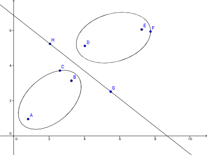
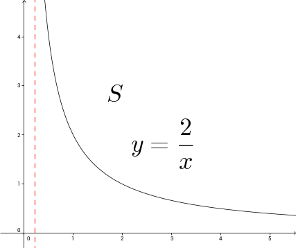
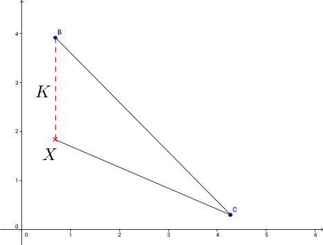
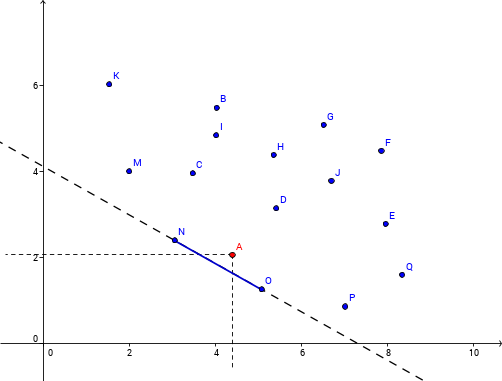

##Lecture Note##

**Seperating Hyperplane Theorem**

$x = (x_{1},\dots,x_{k})$, $\lambda = (\lambda_{1},\dots,\lambda_{k})$, then suppose $S_{1}$ and $S_{2}$ are disjoint convex set in $\mathbb{R}^{k}$, then $\exists \lambda = (\lambda_{1},\dots,\lambda_{k}) \neq 0$ s.t. $\inf_{x \in S_{1}}\lambda 'x \geq \sup_{y \in S_{2}}\lambda 'y$

**Theorem.** If $m$ is admissible and $\Theta$ is finite, then $m$ is the Bayes Rule against some prior distribution.

**Proof.** $X = (\Pi(\theta_{1}, m),\dots,\Pi(\theta_{k}, m))$. Since $m$ is admissible, $Q_{x} \cap S = \{x\}$. Also, $Q_{x} - \{x\}$ and $S$ are disjoint convex sets. There exists $\lambda = (\lambda_{1},\dots,\lambda_{k})$ s.t. $\lambda 'y \leq \lambda 'z, \forall y \in Q_{x} - \{x\}, z \in S$. Claim $\lambda_{i} \geq 0, \forall i$ (if $\lambda_{j} < 0$, then you would have $\sum{\lambda_{j}y_{j}} > \sum{\lambda_{j}x_{j}}$ by making $y_{j}$ very close to $-\infty$), Hence $\lambda_{i} \leq 0 \forall i$, and $\sum{\lambda_{i}} > 0$. We may normalize $\lambda$ so that $\sum{\lambda_{i}} = 1$, and thus $$\sum{\lambda_{j}\Pi(\theta_{j}, m)} \leq \sum{\lambda_{j}z_{j}}$$

Which means in finite case, if it is admissible, then it is Bayes Rule against some prior distribution.

**Notice 1.** For every prior G, the Bayes Rule need not exist. For Example, suppose $G({\theta_{1}}) = 1$

**Notice 2.** Bayes Rule May not be admissible. Suppose $G({\theta_{1}}) = 1$, every point inline $k$ is Bayes against $G$, but only $X$ is admissible.

**Notice 3.** A Bayes Rule need not be randomized. If Randomization, then $S$ is a convex set, suggesting that all points in blue line is admissible but point $A$ is not. However, if not randomized, $A$ is still not Bayes, $N$ and $O$ are still Bayes.

-------------------------------------------------
-------------------------------------------------
**Def.** $\delta^{*}$ is *Minimax*, if for every other $\delta$, $$\sup_{\theta \in \Theta}{R(\theta, \delta^{*})} \leq \sup_{\theta \in \Theta}{R(\theta, \delta)}$$ which means looking at the worst case that can happen for each $\delta$

**Theorem.** $X$ is countable, $\Theta$ is countable, $f_{\theta}(x)$ or $f(x|\theta)$ is the probability function of $X$ for $\theta$, $g(\theta)$ is the prior probability function of $\theta$. Then $g(\theta)f(x|\theta)$ is the joint distribution of $x$ and $\theta$.
$$\Pi(\delta, g) = \sum_{\Theta}{\{\sum_{X}{L(\theta, \delta(x))f(x|\theta)}\}g(\theta)}$$
Let $f(x|\theta)g(\theta) = P(x)P(\theta|x)$, where $P(x) = \sum_{\Theta}{f(x|\theta)g(\theta)}$ We have
$$\Pi(\delta, g) = \sum_{X}{\{\sum_{\Theta}{L(\theta, \delta(x))P(\theta|x)}\}P(x)}$$
Suggesting that we only need to solve the *No Data Problem* using $P(\theta|x)$, $$\sum_{\Theta}{L(\theta, \delta(x))P(\theta|x)}$$

**Theorem.** If for each $x$, $\delta^{*}(x)$ satisfies 
$$\sum_{\Theta}{L(\theta, \delta^{*}(x))P(\theta|x)} = \inf_{d \ in D}{\sum_{\Theta}{L(\theta, \delta(x))P(\theta|x)}}$$
then $\delta^{*}$ is Bayes against prior $G$

*Example.* Suppose $L(\theta, d) = (\theta - d) ^ {2}$, we want to choose d
$$\inf_{d \in \mathbb{R}}{\sum_{\Theta}(\theta - d) ^ {2}P(\theta |x)}$$
where
$$P(\theta |x) = \frac{f(x | \theta)g(\theta)}{P(x)}$$

