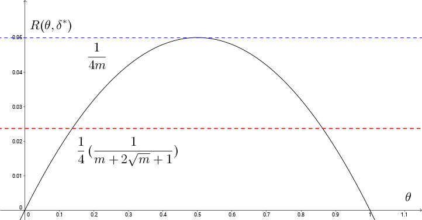

## Expamles of Bayes Estimation

$X$, $f_{\theta}(x) \Leftrightarrow f(x | \theta)$, $g_{\theta}$ is prior distribution

**Goal.** Estimate $\gamma(\theta) = \theta$ using Square Loss Function.
$$\Pi(\delta, g) = \sum_{\Theta}\{\sum_{X}{(\theta - \delta(x))^2f(x|\theta)}\}g(\theta)$$
We want to find $\delta$ that minimizing this $\Pi(\delta, g)$.
$$\Pi(\delta, g) = \sum_{X}\{\sum_{\Theta}{(\theta - \delta(x))^2 P(\theta | x)}\}P(x)$$
If $\delta_{g}$ is Bayes against $g$, then 
$$\delta_{g}(x) = E(\theta | x) = \sum{\theta P(\theta | x)}$$
So that we only need to find $P(\theta | x)$

### Example 1
$X = (X_{1}, X_{2}, \dots, X_{m})~~i.i.d. \sim Bernoulli(\theta)$, where $P(X_{i} = 1) = \theta$, $P(X_{i} = 0) = 1- \theta$, $\theta \in [0,~1]$
$$f(x | \theta) = \theta ^{\sum{x_{i}}}(1 - \theta)^{m - \sum{x_{i}}}$$
$$P(\theta|x) = \frac{\theta ^{\sum{x_{i}}}(1 - \theta)^{m - \sum{x_{i}}}g(\theta)}{\int_{\theta = 0}^{1}{\theta ^{\sum{x_{i}}}(1 - \theta)^{m - \sum{x_{i}}}g(\theta) d\theta}}$$
Note that the denominator part of $P(\theta|x)$ is constant, thus we have
$$P(\theta|x) \propto \theta ^{\sum{x_{i}}}(1 - \theta)^{m - \sum{x_{i}}}g(\theta)$$

**Question.** How can we choose a nice $g(\theta)$ to make life easy.
**Answer.** Choose a conjugate prior distribution, find a distribution that is similar to the likelihood part. In this problem, the answer is *Beta* distribution. Since without $g(\theta)$, $\theta ^{\sum{x_{i}}}(1 - \theta)^{m - \sum{x_{i}}}$ looks like *Beta* distribution.

Let $\alpha,~\beta > 0$
$$g_{\alpha,\beta}(\theta) = \frac{\Gamma(\alpha + \beta)}{\Gamma(\alpha)\Gamma(\beta)}\theta^{\alpha - 1}(1 - \theta)^{\beta - 1}, ~~~~0 < \theta < 1$$

Then we have $E(\theta) = \frac{\alpha}{\alpha + \beta}$, $E(\theta^{2}) = \frac{\alpha(\alpha + 1)}{(\alpha + \beta)(\alpha + \beta + 1)}$, $Var(\theta) = \frac{\alpha \beta}{(\alpha + \beta)^2(\alpha + \beta + 1)}$

Then $$P(\theta | x) \propto \theta^{\alpha + \sum{x_{i}} - 1} (1 - \theta)^{\beta + m - \sum{x_{i}} - 1}$$
$$P(\theta | x) \sim Beta(\alpha + \sum{x_{i}},~ \beta + m - \sum{x_{i}})$$ 

So for estimating $\theta$ with Squared Loss, the Bayes estimation against $Beta(\alpha,~\beta)$ prior is
$$\delta^{*}(x) = \int_{0}^{1}{\theta P(\theta|x)d\theta} = \frac{\sum{x_{i}} + \alpha}{m + \alpha + \beta}$$

Call $\bar{x} = \frac{\sum{x_{i}}}{m}$, then we have
$$\delta^{*}(x) = \frac{m\bar{x} + (\alpha + \beta)\frac{\alpha}{\alpha + \beta}}{m + \alpha + \beta}$$
which is the linear combination of Sample Mean $\bar{x}$ and Prior Mean $\frac{\alpha}{\alpha + \beta}$

If $m \rightarrow \infty$ then $\delta^{*}(x) \rightarrow \bar{x}$

$$R(\theta, \delta^{*}) = E_{\theta}[(\delta^{*}(x) - \theta)^2] = \frac{\theta^{2}[(\alpha + \beta)^{2} - m] + \theta[m - 2\alpha(\alpha + \beta)] + \alpha ^ {2}}{(m + \alpha + \beta) ^ {2}}$$

Note that $\delta^{*}$ must be admissible. Recall an admissible estimate wit constant risk is minimax. So that
$$\Big\{\begin{array}{cc}
(\alpha + \beta)^{2} - m &= 0 \\
m - 2\alpha(\alpha + \beta) &= 0
\end{array}$$
$$\alpha = \beta = \frac{\sqrt{m}}{2}$$
$$R(\theta, \delta^{*}) = \frac{m/4}{(m + \sqrt(m))^{2}} = \frac{1}{4}(\frac{1}{m + 2\sqrt{m} + 1})$$

Recall the maximum likelihood estimate, $\hat{\theta} = \bar{x} = \frac{\sum_{i = 1}^{m}{x_{i}}}{m}$, $R(\theta, \bar{x}) = Var_{\theta}(\bar{x}) = \frac{\theta(1 - \theta)}{m}$

###Example 2

$X = (X_{1}, X_{2}, \dots, X_{m}) ~~~ i.i.d. \sim Possion(\theta)$, $\theta \in (0,~+\infty)$, $$f(x | \theta) = \frac{e^{-m\theta}\theta^{\sum{x_{i}}}}{\prod{x_{i}!}}$$

This suggest that for $\alpha,~\beta>0$, 
$$g_{\alpha,~\beta}(\theta) = \frac{\beta^{\alpha}}{\Gamma(\alpha)}\theta^{\alpha - 1}e^{-\beta\theta}, ~\theta>0$$

This is the $Gamma(\alpha,~\beta)$ distribution. $E(\theta) = \frac{\alpha}{\beta}$, $E(\theta^{2}) = \frac{\alpha(\alpha + 1)}{\beta ^ {2}}$, $Var(\theta) = \frac{\alpha}{\beta^{2}}$

$$P(\theta | x) \propto \theta^{\alpha + \sum{x_{i}} - 1}e^{-(m + \beta)\theta}$$

$P(\theta | x)$ is $Gamma(\alpha + \sum{x_{i}},~ m + \beta)$

###Example 3
$X = (X_{1}, X_{2}, \dots, X_{m}) ~~~ i.i.d. \sim U(0,~\theta)$, $\theta > 0$
$$f(x | \theta) = \Big\{\begin{array}{cc}
\frac{1}{\theta^{m}} & 0 < \min{x_{i}} < \max{x_{i}} < \theta\\
0 & otherwise
\end{array}$$

$$g_{\alpha,~\beta}(\theta) = \Big\{ \begin{array}{cc}
\frac{\beta \alpha^{\beta}}{\theta ^{\beta + 1}} & \theta > \alpha\\
0 & otherwise
\end{array}$$

This is the $Pareto(\alpha,~\beta)$ distribution.

$$P(\theta | x) \propto \Big\{ \begin{array}{cc}
\frac{1}{\theta^{\beta + m + 1}} & \theta > \max{\{\alpha, \max(x_{i})\}}\\
0 & otherwise
\end{array}
$$

$P(\theta | x)$ is $Parato(\max({a, \max{x_{i}}}), \beta + m)$